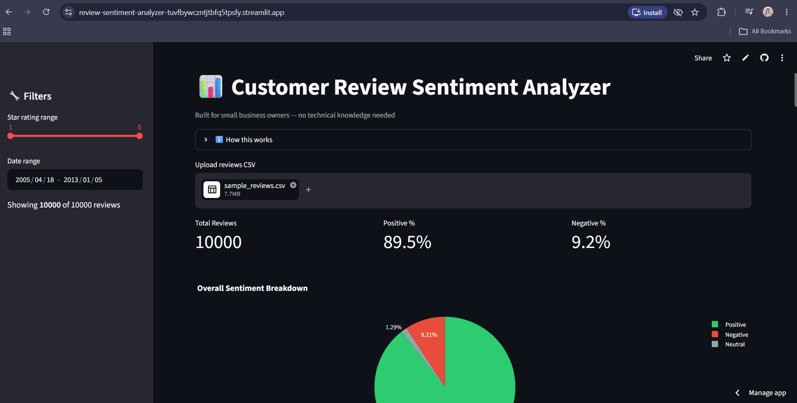

# 📊 Customer Review Sentiment Analyzer

 
A tool that analyzes customer reviews and instantly shows small business owners what customers love — and what's frustrating them.

**🔗 Live app:** https://review-sentiment-analyzer-tuvfbywczntjtbfq5tpsfy.streamlit.app

## What it does

Business owners upload a CSV of their customer reviews (from Google, Yelp, or anywhere else) and instantly get:

- **Overall sentiment breakdown** — Positive / Negative / Neutral, as percentages and a pie chart
- **Sentiment trend over time** — see if customer satisfaction is improving or dropping, month by month
- **Top complaint & praise keywords** — the words that show up most in negative vs. positive reviews
- **Filters** — narrow results by star rating or date range using the sidebar
- **Downloadable report** — export the analyzed data as a CSV

No technical knowledge required — built for restaurant owners, salon owners, clinics, schools, and shops, not developers.

## Tech stack

- **Python** — core language
- **Pandas** — data handling
- **VADER Sentiment** — rule-based sentiment analysis (no ML training required)
- **Streamlit** — interactive dashboard / web app
- **Plotly** — charts (pie chart, trend line)

## How it works

1. Upload a CSV with `text`, `stars`, and `date` columns
2. Each review is scored using VADER's sentiment analysis (`compound` score ≥ 0.05 = Positive, ≤ -0.05 = Negative, otherwise Neutral)
3. Results are visualized instantly — no setup, no waiting

## Run it locally

```bash
git clone https://github.com/Zarlishta6/review-sentiment-analyzer.git
cd review-sentiment-analyzer
pip install -r requirements.txt
streamlit run app.py
```

## Try it with sample data

A sample Yelp reviews dataset (`sample_reviews.csv`) is included in this repo — upload it directly on the live app to see the tool in action.

---

Built as a learning project to explore sentiment analysis and building deployable data tools with Streamlit.
